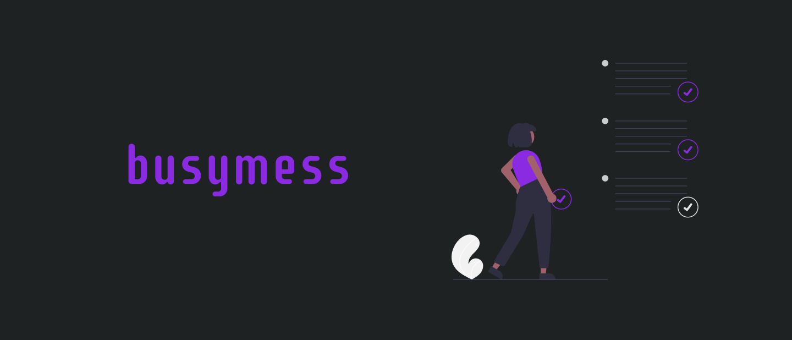

<div align="center">
    
</div>

<div align="center">
    <a href="https://github.com/Gustavo-Henrique-br" >
        
    </a>
    <a href="https://github.com/Gustavo-Henrique-br/Busymess/stargazers"></a>
</div>

<div align="center">
    <a href="https://github.com/Gustavo-Henrique-br/Busymess/blob/master/README.md" title="language - English">
        
    </a>
</div>

<div align="center">
    
    <p>Um aplicativo tipo pipefy para organizar suas tarefas em estilo kanban usando <a href="https://snowpack.dev">snowpack</a></p>
</div>

<hr>

<div align="center">
    <h2>🚧 Busymess 0.3 🚀 Em construção! 🚧</h2>
</div>

Tabela de conteudos
=================
<!--ts-->
   * [Rodando](#rodando)
   * Como usar
      * [Pré-requisitos](#pre-requisitos)
      * [Instalando](#install)
   * [Techs](#techs)
<!--te-->

<div id="rodando" align="center">
    <h1>🎲 Rodando</h1>
</div>

[Veja o projeto em execução](https://gustavo-henrique-br.github.io/Busymess/)

<div id="pre-requisitos" align="center">
    <h4>Pré-requisitos</h4>
</div>

> Antes de começar, você precisa ter instalado na sua máquina:
[Git](https://git-scm.com) e [Node.js (npm)](https://nodejs.org/en/).
> Além disso, é bom ter um editor para trabalhar no código, como o [VSCode](https://code.visualstudio.com/).

<div id="install" align="center">
    <h4>
        Siga esses passos para instalar:
    </h4>
</div>

```bash
# clone o repositório na sua máquina
$ git clone https://github.com/Gustavo-Henrique-br/Busymess.git

# Instale as dependências:
$ yarn
# ou
$ npm install

# Rodando o snowpack no watch mode
$ yarn dev
# ou
$ npm run dev

# Apenas buildando
$ yarn build
# ou
$ npm run build
```

<div id="techs" align="center">
    <h1>🛠 Tecnologias</h1>
</div>

- [Snowpack](https://snowpack.dev)
- [Sass](https://sass-lang.com)
- [Babel](https://babeljs.io)